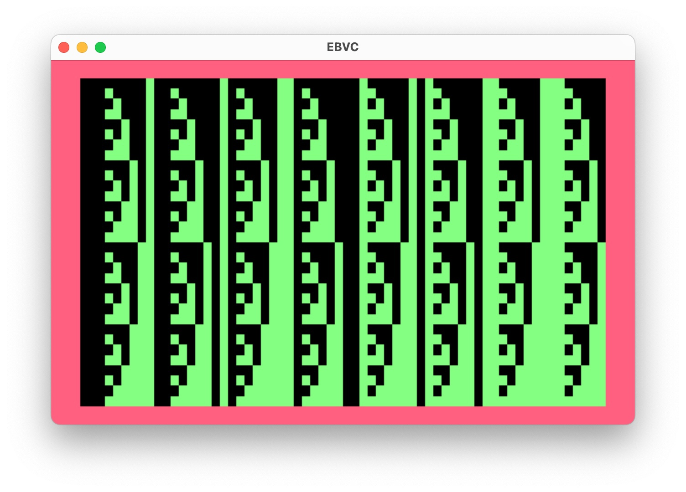
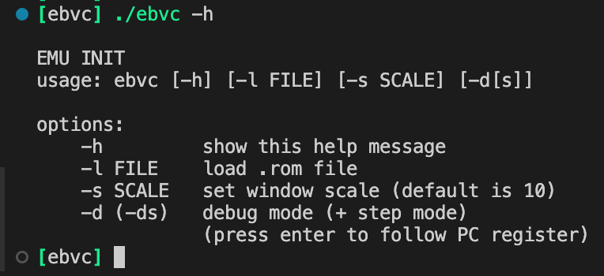
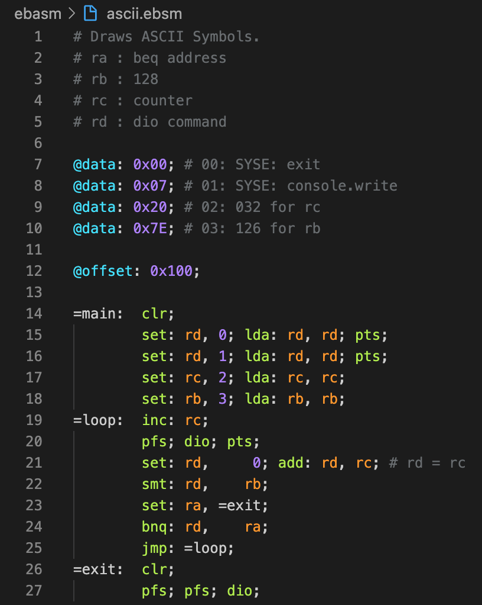

# EBVC : Eight Bit Virutal Computer



### ЭКРАН НЕ РАБОТАЕТ ПОКА ЧТО

## Скрины





## Как запустить:

```bash
$ make
$ ./ebvc -l ./roms/ascii.rom
```

## Devices
* **SYSE** : SYSTEM EIGHT (64x32)
* **SCRE** : SCREEN EIGHT

